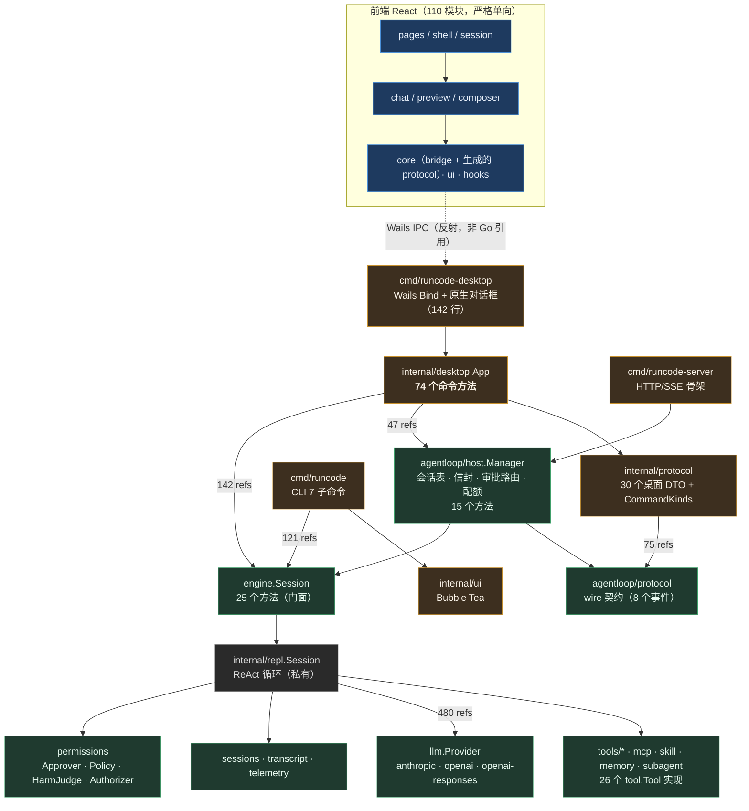
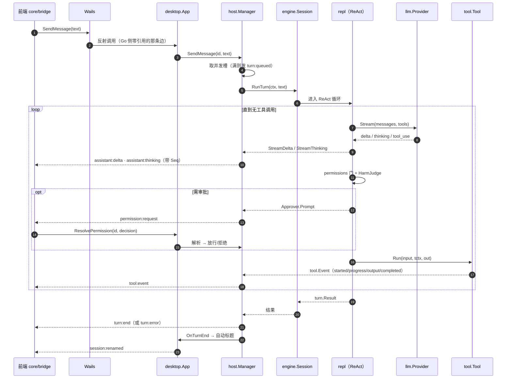
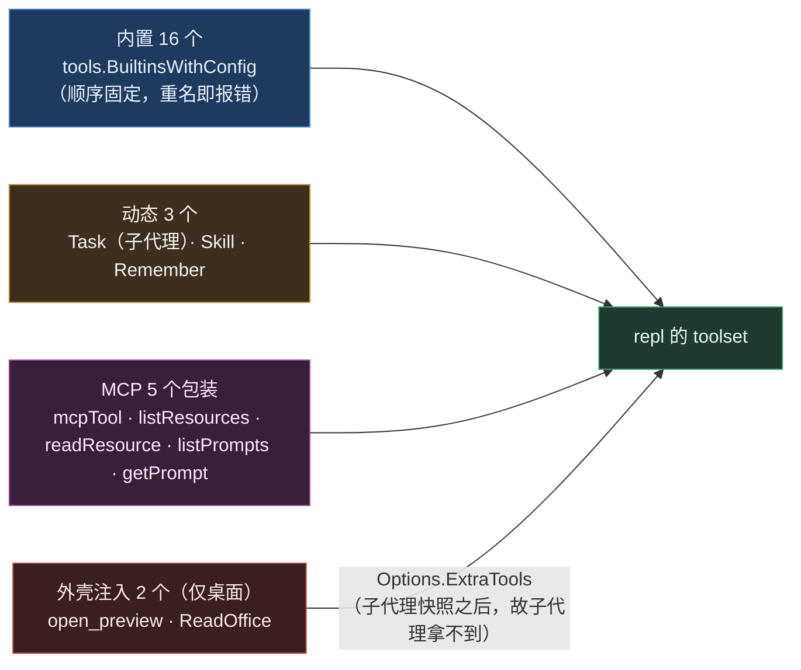
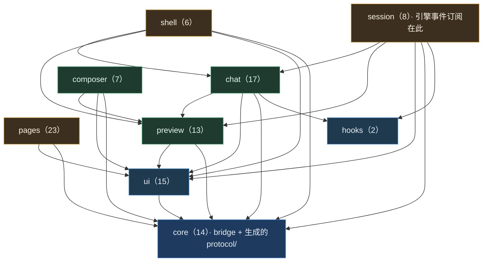

# 系统全览（方法 / 引用 / 抽象接口）

本文档是**机器扫描出来的全览图**，与手写的 [architecture.md](./architecture.md) 互补：那边讲"为什么这么分层"，这边讲"当前代码里实际有什么、谁引用谁、数字多大"。

数据来源不是 grep，而是 `go/types` 全量类型解析（`tools/sysmap`，与 gopls 同一套 `go/packages` 机制），所以接口实现关系、方法集、引用计数都是编译器认定的事实，不是文本匹配。

**重新生成：**

```bash
go run ./tools/sysmap > sysmap.json     # 需要 go.work 联动 ../agentloop
```

## 两个可交互页面（双击即开，离线自包含）

同一份扫描数据还生成了两个单文件 HTML，无外链、无 CDN、浅深主题都做了，右上角可切主题。本文档是给 review 与 diff 用的，那两个页面是给"翻着找"用的：

| 文件 | 看什么 | 能干什么 |
| --- | --- | --- |
| [system-overview.html](./system-overview.html) | 本文档的交互版 | 搜 56 个包 / 46 个接口 / 384 个类型与 505 个方法，按引用数排序，查 `file:line`；174 条引用边可过滤 |
| [system-trees.html](./system-trees.html) | 五棵**手绘风格**树 | 外壳树、引擎树、`tool.Tool` 实现树、`App` 命令树、抽象接口树；点分枝可折叠、可缩放，「重画一遍」换一套笔迹 |

两者都是生成物，提交进库只为方便打开；怎么做出来的、以及重做时的两个坑，见 [tools/sysmap/web/README.md](../tools/sysmap/web/README.md)。

> 扫描口径：`go.work` 四个 module 的全部非测试包（`_test.go` 不计入）。引用计数 = `types.Info.Uses` 里指向该符号的标识符个数，**只含 Go 侧**——经 Wails/反射或 wire 协议跨语言的调用不在其中（这一点本身是个结论，见[Wails 边界](#wails-边界74-个命令60-个在-go-侧零引用)）。

## 一、规模盘点

| 指标 | 数量 |
| --- | --- |
| Go 包（非测试） | 56 |
| Go 代码行 | 44,771 |
| 抽象接口（含方法的 interface） | 46 |
| 具名类型 | 574 |
| 导出方法 | 505 |
| 包级导出函数 | 180 |
| 跨包引用边 | 174 |
| 前端 TS/TSX 模块 | 110（11,554 行） |

分层规模（行数占比）：

| 层 | 包数 | 行数 | 说明 |
| --- | --- | --- | --- |
| engine/support | 21 | 14,255 | `permissions` `mcp` `host` `sessions` `transcript` `telemetry` `skill` `memory` `agent` `settings` `protocol` `tool` … |
| engine/internal | 7 | 5,726 | ReAct 循环 `internal/repl`（4,168 行）、`internal/subagent`、压缩、提示词装配 |
| engine/tools | 14 | 3,985 | 16 个内置工具，每包一个 |
| engine/llm | 3 | 3,775 | `llm` 契约 + anthropic/openai 两个 provider |
| engine/core | 1 | 1,401 | `engine.Build` / `Config` / `Options` / `Session` 门面 |
| shell/desktop-core | 2 | 6,454 | `internal/desktop`（5,881 行）+ `internal/protocol` |
| shell/tui | 2 | 3,188 | `internal/ui` + `internal/command` |
| shell/cli | 1 | 2,393 | `cmd/runcode` 七个子命令 |
| shell/host-tools | 2 | 1,431 | `officetool`（ReadOffice）+ `previewtool`（open_preview） |
| shell/codegen | 1 | 1,125 | `tools/protogen` 协议代码生成器 |
| shell/server | 1 | 896 | `cmd/runcode-server` 骨架 |
| shell/desktop-main | 1 | 142 | Wails `main.go`，只做 `Bind` + 事件桥 |

**引擎 29,142 行 : 外壳 15,629 行**——把重的东西挪出去这件事，数字上确实发生了。

## 二、分层与依赖方向



扫描确认的两条硬纪律：

1. **引擎 → 外壳的引用边为 0**。174 条跨包边里没有任何一条从 `agentloop/*` 指向 `runcode/*`。
2. **`internal/repl` 只被 3 个包引用**（`agentloop` 根、`internal/subagent`、自身测试）。ReAct 循环没有从 `internal` 泄漏出去，外壳只认 `engine.Session` 门面。

## 三、抽象接口（端口）全表

46 个含方法的 interface。按"跨包引用数"排序，越上面越是系统的关节。**加粗**的是外壳真正实现（IoC 注入点）。

| 接口 | 方法 | 实现数 | 引用 | 谁实现 |
| --- | --- | --- | --- | --- |
| `tool.Tool` | 5 | **26** | 72 | 16 内置工具 + MCP 5 + Skill + Remember + Task + **officetool** + **previewtool** |
| `llm.Provider` | 3 | 3 | 24 | anthropic · openai(chat) · openai(responses) |
| `sessions.Backend` | 8 | 2 | 14 | sqlite · jsonl |
| `host.Session` | 13 | 1 | 13 | `*engine.Session`（存在纯粹为了让 host 可测） |
| `telemetry.Recorder` | 2 | 4 | 13 | Async · JSONL · Memory · noop |
| `hooks.Runner` | 1 | 3 | 10 | command · Noop · toolOnlyHooks |
| `permissions.Approver` | 1 | 3 | 10 | **CLI 的 approvalPrompter** · **ui.Approver** · host.AsyncApprover |
| `sessions.Store` | 2 | 3 | 10 | JSONL · sqlite · noop |
| `host.Sink` | 1 | 2 | 9 | **desktop.hostSinkAdapter** · **server.hub** |
| `mcp.Launcher` | 1 | 0 | 8 | （端口预留：进程落在哪由宿主决定，本仓未实现） |
| `llm.Stream` | 3 | 2 | 7 | anthropic.stream · openai.stream |
| `transcript.Recorder` | 2 | 3 | 7 | JSONL · SQLite · noop |
| `permissions.Authorizer` | 1 | 3 | 6 | Bypass · Interactive · NonInteractive |
| `desktop.EventSink` | 1 | 2 | 5 | **wails eventSink** · desktop.envelopeSink |
| `ui.Service` | 7 | 1 | 5 | cmd/runcode.tuiSessionService |
| `permissions.HarmJudge` | 1 | 1 | 5 | **desktop.modelHarmJudge** |
| `engine.Toolset` | 2 | 2 | 5 | localToolset · mcp.Manager |
| `permissions.Policy` | 1 | 1 | 4 | DefaultPolicy |
| `permissions.SessionAllowStore` | 2 | 3 | 4 | FileAllowStore · Memory… · PersistentAllowStore |
| `engine.SubagentLimiter` | 2 | 2 | 4 | host.semaphore（+ 结构等价于 subagent.Limiter） |
| `permissions.PersistentAllowStore` | 4 | 1 | 3 | FileAllowStore |
| `permissions.Resolver` | 1 | 1 | 3 | DefaultResolver |
| `transcript.Reader` | 3 | 1 | 3 | SQLiteRecorder |
| `turn.EditHandle` | 1 | 1 | 3 | **desktop.editHandle** |
| `desktop.Dialoger` | 3 | 1 | 2 | **wails.wailsDialog** |
| `turn.EditRecorder` | 1 | 1 | 2 | **desktop.editStore** |
| `engine.ToolRuntime` | 1 | 1 | 2 | localRuntime（服务端宿主注入 gateway runtime） |
| `sessions.Deleter` | 1 | 2 | 1 | sqliteBackend · jsonlBackend |
| `desktop.titleGenerator` | 1 | 2 | 1 | `*engine.Session`（结构匹配，非声明依赖） |

余下 17 个是包内私有的窄接口（`mcp.messageStream`/`toolCaller`、openai 的 `sseStream`/`sseDecoder`/`doer`/`completionClient`/`responsesClient`、anthropic 的 `sdkStream`/`messageStreamClient`、CLI 的 `chatRunner`/`lineReader`/`tuiRunner`、`repl.EditRecorder`/`EditHandle`、`subagent.Limiter` 等）——它们是为了测试替身而存在的接缝，不是跨层契约。

### 值得注意的三个形状

- **`tool.Tool` 是唯一的高扇出接口**（26 实现 / 24 个包引用）。工具执行位置无关这件事就靠它：本地工具、MCP 转发工具、沙箱转发工具在权限门、harm 判定、事件流面前完全同形。桌面专属的两个工具（`open_preview`、`ReadOffice`）从外壳侧实现同一接口，经 `Options.ExtraTools` 注入——**外壳扩展引擎能力却不改引擎**，这是这套边界最值钱的一处。
- **`engine.SubagentLimiter` 与 `subagent.Limiter` 是一对孪生接口**。后者在 `internal` 包里，`Options` 语法上没法引用它，于是根包声明了一个同形的；`types.Implements` 确认两者互相满足。这是 Go 的 `internal` 约束逼出来的形状，不是冗余。
- **`mcp.Launcher` 有 8 处引用、0 个实现**。这是留给服务端宿主的端口（"MCP 进程起在哪"），本仓两个外壳都走默认本地子进程。同理 `ToolRuntime` 只有 `localRuntime`。

## 四、方法面：三个主类型

| 类型 | 导出方法 | 引用 | 位置 |
| --- | --- | --- | --- |
| `desktop.App` | **74** | 122 | `internal/desktop/app.go:53` |
| `engine.Session` | 25 | 32 | `agentloop/engine.go:148` |
| `repl.Session`（私有） | 21 | 65 | `agentloop/internal/repl/session.go:145` |
| `host.Manager` | 15 | 30 | `agentloop/host/manager.go:76` |
| `mcp.Client` | 11 | 27 | `agentloop/mcp/client.go:58` |

### `desktop.App` 的 74 个命令（按文件分工）

Wails 要求所有命令挂在同一个类型上，所以 `App` 必然是宽的；分工靠文件而非包：

| 文件 | 数 | 命令 |
| --- | --- | --- |
| `passport.go` | 10 | ActiveTenant · PassportCancelLogin · PassportLogin · PassportLogout · PassportModels · PassportStatus · PassportTenants · PassportValidate · SessionModels · SetActiveTenant |
| `app.go` | 7 | CloseSession · GetProtocolInfo · Reset · SetDialoger · StartSession · Startup · Status |
| `sessions.go` | 7 | DeleteSession · ListSessions · ListTools · NewSession · PickWorkspaceFolder · ResumeSession · SwitchWorkspace |
| `session_settings.go` | 7 | SaveSettings · SetModel · SetPermissionMode · SetPlanMode · SetReasoningScenario · SetThinkingEffort · SwitchModel |
| `turn.go` | 5 | Compact · InjectMessage · Interrupt · ResolvePermission · SendMessage |
| `mcp.go` | 5 | DeleteMCPServer · ListMCPServers · ReloadMCPServers · SaveMCPServer · SetMCPServerEnabled |
| `agents.go` / `skills.go` | 4 + 4 | Delete/Import/List/Save × {Agent, Skill} |
| `custommodels.go` | 3 | DeleteCustomModel · ListCustomModels · SaveCustomModel |
| `attachments.go` | 3 | InjectMessageWithImages · PickImageAttachment · SendMessageWithImages |
| `editstore.go` | 3 | ListEdits · RevertEdit · ReviewEdit |
| `open.go` | 3 | OpenExternal · ResolveArtifactPath · RevealInFolder |
| `context.go` | 3 | ReadMemory · ReadProjectContext · SaveProjectContext |
| `disabled.go` | 3 | SetAgentEnabled · SetSkillEnabled · SetToolEnabled |
| `preview.go` / `webproxy.go` | 2 + 2 | ReadArtifact(Bytes) · SetWebProxy/WebProxy |
| `files.go` / `store.go` / `mcpmarket.go` | 1 × 3 | ListFiles · LoadConfig · McpMarket |

### Wails 边界：74 个命令，60 个在 Go 侧零引用

扫描出的最有意思的一条：**74 个命令方法里有 60 个的 Go 侧引用数为 0**。它们不是死代码——它们全部经 Wails 的反射绑定被前端调用，编译器看不见这条边。

这正是 `tools/protogen` 必须存在的理由：`internal/protocol.CommandKinds`（23 query / 24 idempotent-set / 25 trigger，共 72 条登记）与 `App` 的导出方法互相交叉核对，方法漏登记或登记了不存在的方法都让生成失败，CI 用 `--check` 把关。**编译器管不到的那条边，由代码生成器管。**

## 五、跨包引用强度（Top 20 边）

| 引用数 | 边 | 读法 |
| --- | --- | --- |
| 480 | `repl → llm` | ReAct 循环几乎全在搬 llm 类型，正常 |
| 424 | `desktop → internal/protocol` | 桌面 DTO 都在自己家，没漏进引擎 |
| 411 | `openai → llm` | provider 适配 |
| 305 | `repl → tool` | 工具调度 |
| 186 | `anthropic → llm` | provider 适配 |
| 182 | `repl → telemetry` | 埋点密度较高 |
| 178 | `mcp → tool` | MCP 工具适配到统一契约 |
| 142 | `desktop → engine`(根) | Config/Options/Status |
| 138 | `tools/bash → tool` | 三件套工具 |
| 130 | `server → protocol` / `host → protocol` | 两个数字几乎相等——服务端骨架确实只吃 wire 契约 |
| 121 | `cmd/runcode → engine`(根) | CLI 直接拼 Session（单会话，不过 host） |
| 85 / 71 / 70 | `cli / ui / desktop → permissions` | 三个外壳各自桥接审批 |
| 75 | `internal/protocol → agentloop/protocol` | 桌面 DTO 复用 envelope/错误码 |
| 64 | `engine(根) → internal/repl` | 门面唯一的入口 |
| 47 | `desktop → host` | 薄适配层，数字小是对的 |
| 4 | `cmd/runcode-desktop → internal/desktop` | Wails 层只有 `Bind` 那几行 |

`desktop → host` 只有 47 次引用，而 `desktop → engine 根` 有 142 次：桌面在会话生命周期上依赖 host，在配置/状态类型上依赖引擎根包。

## 六、一次回合的数据流



事件面共 11 个：引擎 8 个（`assistant:delta` `assistant:thinking` `llm:retry` `permission:request` `tool:event` `turn:end` `turn:error` `turn:queued`）+ 桌面自有 3 个（`harm:autoallow` `passport:changed` `session:renamed`）。

## 七、工具面：模型能看到什么

`tool.Tool` 的 26 个实现分四类来源：



内置 16 个（`tools/registry.go` 的固定顺序）：`Read` `Write` `Edit` `Delete` `Glob` `Grep` `Bash` `BashOutput` `KillShell` `TodoWrite` `WebFetch` `WebSearch` `Analyze` `AskUser` `Wait` `GetCurrentTime`。

## 八、前端分层（扫描确认单向）

110 个 TS/TSX 模块，`@/` 别名的实际引用方向：



被引用次数：`@/ui` 85 · `@/core` 68 · `@/chat` 20 · `@/preview` 13 · `@/session` 8 · `@/shell` 6 · `@/hooks` 6 · `@/pages` 5。**没有一条反向边**（`core` 只引 `@/assets`，`ui` 只引 `@/core`，`hooks` 谁都不引）。

## 九、扫描口径与已知盲区

- **只覆盖 Go 与 TS 的静态结构。** 运行期通过反射（Wails 绑定）、wire 协议（前后端）、`os/exec`（MCP stdio、hooks）连起来的边，静态分析看不见——这些边分别由 `protogen --check`、`deps_test.go`、集成测试兜。
- **引用计数不含测试文件。** `_test.go` 被排除，所以"零引用"不代表"零测试"；`desktop.App` 的 122 次引用里大部分来自非测试代码路径。
- **`sessions/backendtest` 是测试工具包**，虽非 `_test.go` 但只服务测试，计入了包数与行数。
- **依赖解析用 export data，不是全源码类型检查**（`packages.NeedDeps` 关掉了：开着会连 `modernc.org/libc` 一起从源码类型检查，慢到不可用）。这不影响本仓与引擎符号的解析精度——初始包全部是源码级类型检查。
- **地图不含制图者。** `tools/sysmap` 把自己排除在扫描之外（`inWorkspace` 里显式跳过），否则每次改这个工具本身，全表数字都会漂。`tools/protogen` 不排除——它是构建契约的一部分，CI 会跑。
- **本次没走 LSP。** 环境未配置 Go 语言服务器、也没装 `gopls`，因此直接调用 `go/packages` + `go/types`——与 gopls 底下同一套机制，只是省掉了 LSP 那层协议。
